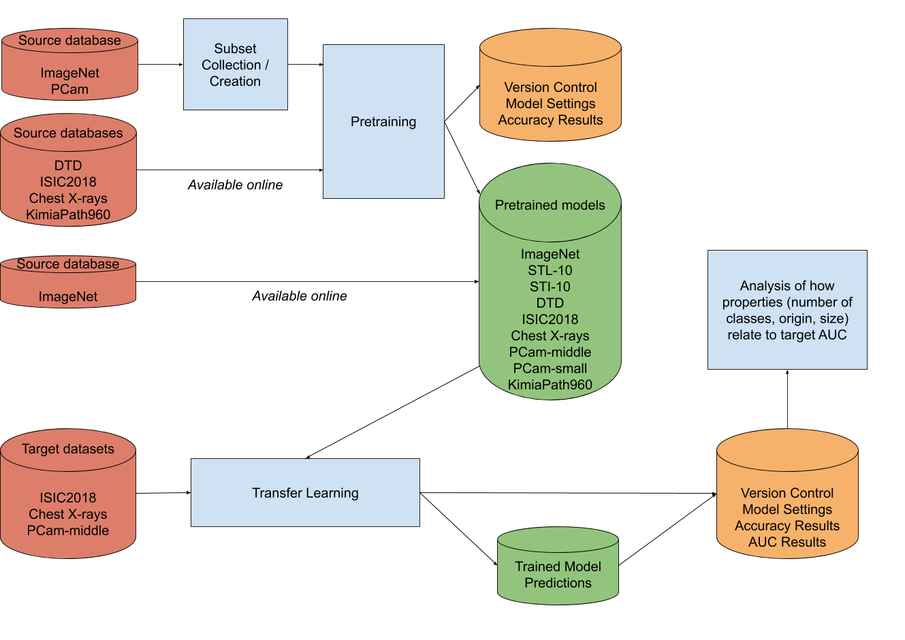

## Subproject 1 - Dataset properties 
  Transfer learning approaches are often used in medical image classification applications to help overcome data 
  shortages. Although several large databases have proven to be successful, the questions still remains which dataset
  properties are necessary for optimal transfer learning for medical image analysis models. This project explores 
  the influence of dataset properties like size or origin on the transfer learning performance obtained on the target 
  data. 
 

<!-- TABLE OF CONTENTS -->
## Table of Contents

* [About the Project](#about-the-project)
  * [Built With](#built-with)
* [Getting Started](#getting-started)
  * [Prerequisites](#prerequisites)
  * [Installation](#installation)
* [Usage](#usage)
* [Roadmap](#roadmap)


<!-- ABOUT THE PROJECT -->
## About The Project
The project includes nine different datasets created from six databases. These are the following:
1. [ImageNet](http://image-net.org)
2. [Describable Textures Dataset (DTD)](https://www.robots.ox.ac.uk/~vgg/data/dtd/)
3. [ISIC2018 - Task 3 - the training set](https://challenge2018.isic-archive.com/task3/training/)
4. [Chest X-rays](https://www.kaggle.com/paultimothymooney/chest-xray-pneumonia)
5. [PatchCamelyon (PCam)](http://basveeling.nl/posts/pcam/)
6. [KimiaPath960](https://www.kaggle.com/ambarish/kimia-path-960)

Two ImageNet subsets, STL-10 and self-made subset STI-10, are used. To speed up training PCam is decreased in size to 
100.000 and 10.000 for subsets PCam-middle and PCam-small.

The nine different datasets are all used as source dataset, the medical datasets ISIC2018, Chest X-rays and PCam-middle 
are used as target dataset.


### Built With

* Keras
* Sacred
* Neptune 
* OSF

The experiments are logged used Sacred with a Neptune observer. The results, code version and model settings of all
experiments can be found on https://ui.neptune.ai/irmavdbrandt/cats-scans/experiments?viewId=standard-view. For access
please e-mail to irma.vdbrandt@gmail.com. The trained models and predictions are stored on Open Science Framework: 
https://osf.io/x2fpg/. 


### Project Structure
The project is structured as shown in the flowchart. 

* Dataset collection/creation:
The different datasets are collected (and created) using the data_import.py and 
ImageNet_subset_creator.py files in the io-folder. Specific paths to the different datasets are to be set in the
data_paths.py file. The PCam-dataset is first converted to PNG-files and stored in the home directory using the
pcam_converter.py file. The PNG-images are collected using the data_import.py file. 

* Pretraining:
In the transfer_experiments.py file the pretraining experiment is created and connected with Sacred. In the models 
folder the model_preparation_saving.py and tf_generators_models_kfold.py files include functions that create the 
necessary model, generators, etc. After pretraining the trained model is stored on OSF using the requests_OSF.py file. 
The experiment results are logged into Neptune using Sacred. 

* Transfer learning and evaluation:
The pretrained models are used in the transfer learning experiments, created in the transfer_experiments.py file. 
Similarly to pretraining, models, generators etc. are created using the model_preparation_saving.py and 
tf_generators_models_kfold.py files. The transfer performance is evaluated using the AUC_evaluation.py file in the
evaluation folder. The resulting models, weights and predictions are stored on OSF with the 
requests_OSF.py file. The experiment results are logged into Neptune using Sacred. 
Figures included in the paper are created using the visualization functions in the AUC_evaluation.py file. Note that 
for this the trained models need to be in the home directory.

Extra: 
Feature maps of the models can be created using the featuremaps_viz.py file, plots showing the stability during 
training/validation/testing can be created using the stability_plot.py file. 




### Prerequisites

The packages needed to run the project are listed in the requirements.txt file.

The databases used in the project need to be downloaded and stored in the home directory of the project. Download links
can be found on the reference website of the dataset.

<!-- USAGE EXAMPLES -->
## Usage

In the top section of the transfer_experiments.py file an experiment can be defined. An example:

First give the experiment a meaningful name.
```shell script
ex = Experiment('Resnet_pretrained=isic_target=pcam-middle')
```
Define arguments for the experiment such as parameter settings, which datasets to use, etc.
```shell script
target = True
source_data = "isic"
target_data = "pcam-middle"
x_col = "path"
y_col = "class"
augment = True
k = 5
img_length = 96
img_width = 96
learning_rate = 0.000001
batch_size = 128
epochs = 20
color = True
dropout = 0.5
scheduler_bool = False
home = '/data/'
```
Run the experiment by running the python file. Include server specifications if necessary.
```shell script
python -m src.transfer_experiments.py 
```


<!-- ROADMAP -->
## Roadmap

See [project](https://github.com/vcheplygina/cats-scans/projects/1) for a list of issues that are used to create the 
project.


