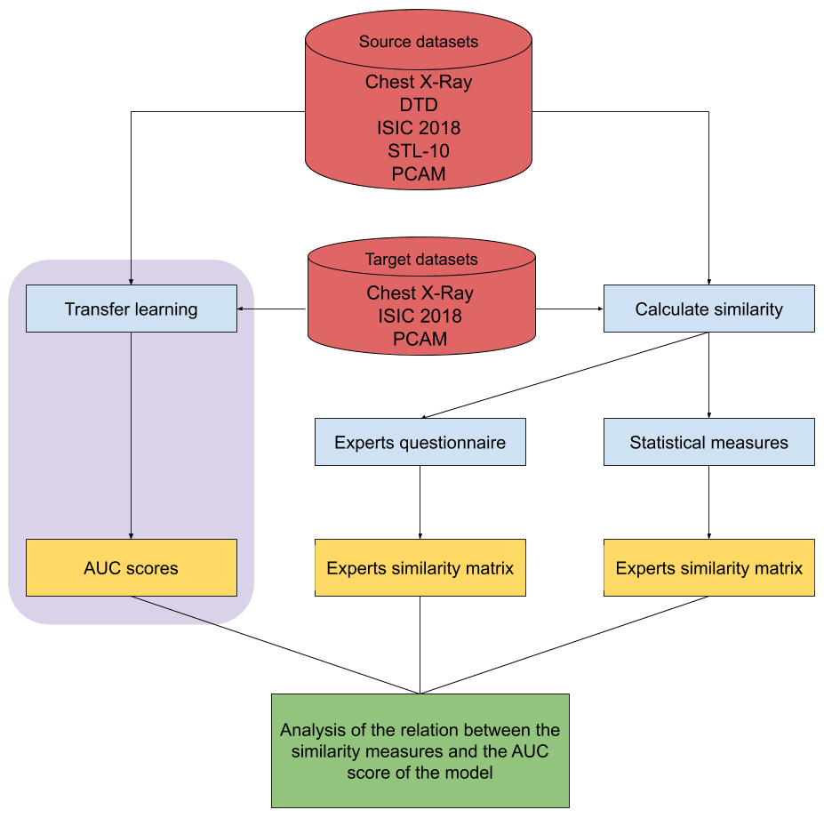

## Subproject 2 - Dataset similarities

### Project abstract
The aim of this project is to investigate the relation between the performance of a transfer learned model and the similarity of the source- and target datasets. In order to do this, medical as well as non-medical datasets were analyzed by means of different types of meta-features, experts- and statistical meta-features respectively. Combining experts’ input and statistical measures has, as known so far, not  been done yet and has the goal of getting a broader knowledge of the relation between dataset characteristics and model performance. It could also expose the potential of human judgement in (source) dataset selection as opposed to statistical measures. The experts meta-features are based on answers to a questionnaire about the datasets filled in by experts, whereas the latter are based on statistical measures of the image histograms. From these results, the Euclidean distance is determined for different combinations of source- and target datasets. These distances, which are a measure of the similarity between two datasets, are then compared to the AUC score of the model. The results show no correlation between similarity, based on either one of the two types of meta-features, and the performance of the model.


<!-- TABLE OF CONTENTS -->
## Table of Contents

* [About the Project](#about-the-project)
* [Getting Started](#getting-started)
  * [Prerequisites](#prerequisites)
  * [Project structure](#project-structure)
* [Usage](#usage)
* [Roadmap](#roadmap)


<!-- ABOUT THE PROJECT -->
## About The Project
5 datasets were used for the experiments. These are the following:
1. [Chest X-rays](https://www.kaggle.com/paultimothymooney/chest-xray-pneumonia)
2. [Describable Textures Dataset (DTD)](https://www.robots.ox.ac.uk/~vgg/data/dtd/)
3. [ISIC2018 - Task 3 - the training set](https://challenge2018.isic-archive.com/task3/training/)
4. [STL-10](https://cs.stanford.edu/~acoates/stl10/)
5. [PatchCamelyon (PCam)](http://basveeling.nl/posts/pcam/)

Considering the initial size of the PCAM dataset (327.680 images), a subset of 100.000 images was used to speed up training and calculation times.

The aforementioned dataset were all downloaded from the internet and stored in the local_data folder according to the depository structure depicted in the figure below.

### Prerequisites

The packages needed to run the project are listed in the requirements.txt file.

The aforementioned dataset were all downloaded from the internet and stored in the local_data folder according to the depository structure depicted below. For the sake of overview, the label folder and images have been left out of the structure. The local_data folder also contains an excel file containing the answers from the experts. The local_data folder can be downloaded with the link below the depository structure.

C:.\
\\---target_auc.npy\
\\---expert_answers.csv\
\\---datasets\
    &nbsp;&nbsp;&nbsp;&nbsp;&nbsp;&nbsp;+---chest_xray\
    &nbsp;&nbsp;&nbsp;&nbsp;&nbsp;&nbsp;+---dtd\
    &nbsp;&nbsp;&nbsp;&nbsp;&nbsp;&nbsp;+---ISIC2018\
    &nbsp;&nbsp;&nbsp;&nbsp;&nbsp;&nbsp;+---pcam\
    &nbsp;&nbsp;&nbsp;&nbsp;&nbsp;&nbsp;|   &nbsp;&nbsp;&nbsp;&nbsp;&nbsp;&nbsp;+---pcam_full (This folder was left empty to reduce download times)\
    &nbsp;&nbsp;&nbsp;&nbsp;&nbsp;&nbsp;|   &nbsp;&nbsp;&nbsp;&nbsp;&nbsp;&nbsp;+---pcam_subset\
    &nbsp;&nbsp;&nbsp;&nbsp;&nbsp;&nbsp;|   &nbsp;&nbsp;&nbsp;&nbsp;&nbsp;&nbsp;\\---PCAM_subset.csv\
    &nbsp;&nbsp;&nbsp;&nbsp;&nbsp;&nbsp;\\---stl_10

This folder can be downloaded via the following link: LINK

If problems arise, please send an email to b.m.h.m.mulders@student.tue.nl

### Project Structure

* Importing data etc.:\
All datasets were downloaded from the internet and stored in locally in the local_data folder along with the expert_answers excel file. For STL-10, a code had to be used to extract the .tar files in order to get the images, this code is located [here](../src/io/get_stl_10.py). As mentioned, for PCAM a subset of 100.000 images was created. This subset was predefined by Irma van den Brandt to train the model. The names of the images in the subset were specified in the PCAM_subset.csv file (located in the local_data/datasets/pcam folder) and transfered to a new subset folder with this [code](../src/io/create_pcam_subset.py). The local_data folder that can be downloaded with the link above contains all the images of STL-10 and subset of PCAM, hence the steps mentioned above do not have to be executed if the local_data folder is downloaded. 

* Calculating statistical similarity matrix:\
First, all the local images are loaded in and converted to numpy arrays with the [converter_numpy.py](../src/io/converter_numpy.py) file. Subsequently 6 statistical measures are calculated for each images, these statistical measures are functions located in the [meta_features.py](../src/similarity/meta_features.py) file. Then, storing all the values and calcuting the distances between the vectors is done in [mfe_function.py](../src/similarity/mfe_function).

* Calculating experts similarity matrix:\
Loading in the answers from the experts and calculating the similarity matrix was done in [expert_answer_import.py](../src/io/expert_answer_import.py).

* Matrix post-processing:\
Normalizing and inverting the values of the matrices was done with the aim of making the results easier to interpret. This was done in this [code](../src/io/matrix_processing.py).

* Results output:\
The heatmaps, as seen in the paper, are constructed in this [code](../src/evaluation/numpy_to_heatmap.py). The bar charts were made [here](../src/evaluation/make_bar_chart.py). All the output figures can be found in [this](../outputs) folder.

The complete structure of all the conducted experiments is shown in the figure below. (purple highlighted area is done for another project, by Irma van den Brandt)



<!-- USAGE EXAMPLES -->
## Usage

All the experiments can be executed from the [similarity_experiment.py](../src/similarity_experiment.py) file and are divided in different sections:

Define all the arguments for the experiments in the first section.
```shell script
# Below the absolute path to the local_data folder (which should be downloaded) should be specified

absolute_path_local_data = 'C:/Users/20169385/PycharmProjects/cats-scans/local_data'

# Specify a list containing all the names of the datasets you want to compare (case sensitive)

datasets_list = ['chest_xray', 'dtd', 'ISIC2018', 'stl-10', 'pcam']     # Possible dataset names: 'chest_xray', 'dtd', 'ISIC2018', 'stl-10' and 'pcam'

# Specify size of subset. Should be above 50 to avoid errors with regard to number of labels.

defined_subset = 'None'     # Besides numerical values, 'None' is also an option. In this case a maximum of 15.000 images of every dataset is taken to avoid a memory error

# Specify location were figure will be saved

save_path = 'C:/Users/20169385/PycharmProjects/cats-scans/outputs'
```
The following sections contain the experiments. Please run the appropriate section depending on what experiment you want to do, as explained below.

For calculating the statistical similarity matrix, pleasure run the following section. A heatmap will be outputted in the specified location, the name of the figure can be specified in this section.
```shell script
save_name = 'stat_heatmap'  # Define the name of the output figure

stat_sim = norm_and_invert((((feature_extraction(datasets=datasets_list, mfe_path = absolute_path_local_data+'/datasets', mfe_subset=defined_subset, color_channel='blue'))
                                   + (feature_extraction(datasets=datasets_list, mfe_path = absolute_path_local_data+'/datasets', mfe_subset=defined_subset, color_channel='green'))
                                   + (feature_extraction(datasets=datasets_list, mfe_path = absolute_path_local_data+'/datasets', mfe_subset=defined_subset, color_channel='red')))/3))

stat_heatmap = make_heatmap(stat_sim, data_list = datasets_list, name = save_name, output_path = save_path)
```

For calculating the statistical similarity matrix, pleasure run the following section. A heatmap will be outputted in the specified location, the name of the figure can be specified in this section.

```shell script
save_name = 'exp_heatmap'   # Define the name of the output figure

expert_sim = norm_and_invert(expert_answers(expert_answer_path=absolute_path_local_data))

make_heatmap(expert_sim, data_list = datasets_list, name = save_name, output_path = save_path)
```

If you want to create the heatmap of the AUC scores, run the following section.

```shell script
save_name = 'auc_heatmap'   # Define the name of the output figure

auc_scores = np.load(absolute_path_local_data + '/target_auc.npy')

auc_heatmap = make_heatmap(auc_scores, data_list = datasets_list, name = save_name, output_path = save_path, auc='yes')
```

The bar charts can be made by running the section as seen below. The target dataset should be specified in this section.

```shell script
target_data = 'chest_xray'    # Choose target dataset (options: 'chest_xray', 'ISIC2018', 'pcam')

make_bars(datalist = datasets_list, target_dataset = target_data,
          auc_mat = auc_scores, stat_mat = stat_sim, exp_mat = expert_sim, name = target_data + '_bars', output_path = save_path)
```

<!-- ROADMAP -->
## Roadmap

See [project](https://github.com/vcheplygina/cats-scans/projects/1) for a list of issues that are used to create the 
project.


